# Projektdokumentation – Flexmatch

> **Flexmatch** – Flexible Jobs. Sofort verfügbar. Ein niederschwelliger Prototyp für die Vermittlung flexibler Kurzzeiteinsätze in der Schweiz.

| | |
|---|---|
| **Live-Demo** | https://flexmatch-zhaw.netlify.app |
| **Repository** | https://github.com/ferrepa/Flexmatch |
| **Figma-Prototyp (interaktiv)** | https://www.figma.com/design/ZlzqO8R94gHmY8DCFV4zNj – im „Present"-Modus klickbar (Login → Jobs → Detail → Bewerbung → Profil) |
| **Mockup (PNG)** | [`docs/mockup/flexmatch-mockup-overview.png`](docs/mockup/flexmatch-mockup-overview.png) |
| **Autor** | Patrick Ferreira · ferrepa1@students.zhaw.ch |
| **Modul** | w.BA.XX.3Pt-WIN.XX – Prototyping mit Webtechnologien (FS26) |
| **Video** | Kommentierter Walkthrough (5–6 Min) – als Datei auf Moodle abgegeben |
| **Demo-Login** | demo@flexmatch.ch · demo1234 (oder eigenes Konto registrieren) |
| **Zugang** | Registrierung/Login erforderlich – Jobs sind erst nach Anmeldung sichtbar |

## Inhaltsverzeichnis

1. [Ausgangslage](#1-ausgangslage)
2. [Lösungsidee](#2-lösungsidee)
3. [Vorgehen & Artefakte](#3-vorgehen--artefakte)
    1. [Understand & Define](#31-understand--define)
    2. [Sketch](#32-sketch)
    3. [Decide](#33-decide)
    4. [Prototype](#34-prototype)
    5. [Validate](#35-validate)
4. [Erweiterungen](#4-erweiterungen)
5. [Projektorganisation](#5-projektorganisation)
6. [KI-Deklaration](#6-ki-deklaration)
7. [Anhang](#7-anhang)

> **Hinweis:** Massgeblich sind die im **Unterricht** und auf **Moodle** kommunizierten Anforderungen.

<!-- WICHTIG: DIE KAPITELSTRUKTUR DARF NICHT VERÄNDERT WERDEN! -->

---

## 1. Ausgangslage

Kurz beschrieben adressiert Flexmatch die hohe Einstiegshürde bei der Suche nach flexiblen Kurzzeiteinsätzen.

- **Problem:** Schweizer Jobvermittlungsplattformen für flexible Einsätze (Temporär-, Gig- und Stundenarbeit) sind in der Bedienung oft komplex. Für Arbeitssuchende – insbesondere Studierende und Teilzeitkräfte – ist der Bewerbungsprozess zu aufwendig: viele Klicks, unübersichtliche Joblisten, kein schnelles Filtern oder Suchen, und meist ein verpflichtender Registrierungsprozess, bevor man überhaupt eine Stelle ansehen oder sich bewerben kann. Das Ergebnis ist Abbruch statt Bewerbung.
- **Ziele:**
  - Schnelle Jobsuche mit Volltext-Suche sowie Filter nach Kategorie und Ort
  - Sortierung nach den für die Zielgruppe wichtigsten Kriterien (Stundenlohn, Aktualität)
  - Unkomplizierte Bewerbung in wenigen Schritten – ohne Konto, ohne langes Anschreiben
  - Übersicht über die eigenen Bewerbungen
  - Mobil-optimiertes, responsives Design (Mobile-First)
- **Primäre Zielgruppe:** Arbeitssuchende in der Schweiz, die flexible Kurzzeiteinsätze suchen – insbesondere **Studierende, Teilzeitkräfte und Personen in Überbrückungssituationen** (ca. 20–35 Jahre, smartphone-affin, zeitlich flexibel, preis-/lohnsensitiv).
- **Weitere Stakeholder:** Schweizer Unternehmen als Job-Ausschreibende (Gastronomie, Logistik, Detailhandel, Events, Reinigung, Büro), die kurzfristig Personal benötigen.

---

## 2. Lösungsidee

Flexmatch ist ein funktionsfähiger Web-Prototyp, der die drei zentralen Use Cases einer Jobvermittlung in einem schlanken, mobilen Flow abbildet.

- **Kernfunktionalität:**
  1. **Registrierung & Login** (`/register`, `/login`) – Konto erstellen oder anmelden; Jobs sind erst nach Anmeldung sichtbar (Demo-Login verfügbar)
  2. **Jobsuche** (`/jobs`) – Alle verfügbaren Jobs anzeigen, per Volltext durchsuchen, nach Kategorie und Ort filtern, nach Lohn/Datum sortieren
  3. **Job-Detail** (`/jobs/[id]`) – Stellenbeschreibung, Anforderungen, Eckdaten, Bewerben-Button, „Job merken" und Empfehlungen (Ähnliche Jobs)
  4. **Bewerbung** (`/jobs/[id]/apply`) – Formular mit Name, E-Mail, Telefon, Nachricht; server-seitige Validierung und Persistenz; Status «In Prüfung»
  5. **Merkliste** (`/favorites`) – interessante Jobs merken und vergleichen
  6. **Meine Bewerbungen** (`/my-applications`) – Übersicht aller Bewerbungen mit Status, Lösch-Option und Mini-Dashboard
  7. **Profil** (`/profile`) – Lebenslauf hochladen, „Über mich", Erfahrung/Einsätze, Ausbildung, Sprachen und Bewertungen; wird Arbeitgebern bei einer Bewerbung angezeigt
- **Annahmen:** Nutzerinnen und Nutzer erstellen vor der Jobsuche ein Konto (wie bei vergleichbaren Plattformen üblich); ein **Demo-Login** senkt die Hürde fürs Ausprobieren. Der Stundenlohn und das Pensum sind die wichtigsten Entscheidungskriterien und müssen sofort sichtbar sein.
- **Abgrenzung:** Die Authentifizierung ist **prototyp-tauglich** umgesetzt (Registrierung/Login, Cookie-Session, Passwörter als SHA-256-Hash), jedoch **ohne** E-Mail-Verifikation, Passwort-Reset oder 2FA. Kein Arbeitgeber-Dashboard, keine echte E-Mail-Versendung, keine Bezahl-/Vertragsfunktion. Bewerbungen erhalten den Status «In Prüfung»; eine echte Zu-/Absage durch den Arbeitgeber erfolgt nicht (kein Arbeitgeber-Backend, keine Benachrichtigungen).

---

## 3. Vorgehen & Artefakte

Die Durchführung folgte den Phasen des Design-Sprint-Vorgehens (Understand → Sketch → Decide → Prototype → Validate). Die wichtigsten Ergebnisse je Phase sind nachfolgend dokumentiert.

### 3.1 Understand & Define

- **Zielgruppenverständnis:** Analyse bestehender Schweizer Vermittlungsplattformen (z. B. jobs.ch, Adia, Staff Finder) aus Nutzerperspektive. Identifikation der drei häufigsten Use Cases: (1) Job nach Branche/Ort suchen, (2) sich auf einen Job bewerben, (3) eigene Bewerbungen verwalten.

- **Proto-Personas:**

  | | **Lena, 23** | **Marco, 29** |
  |---|---|---|
  | Rolle | BWL-Studentin, sucht Wochenend-Einsätze | Teilzeit/Überbrückung nach Stellenwechsel |
  | Kontext | Hauptsächlich am Smartphone, wenig Zeit | Sucht abends am Laptop, mehrere Bewerbungen |
  | Bedürfnis | „Schnell sehen, was in Zürich am Wochenende bezahlt wird – und in 2 Minuten bewerben." | „Nach Lohn sortieren, ohne mich erst zu registrieren." |
  | Frust heute | Registrierungspflicht, unübersichtliche Listen | Lohn erst nach mehreren Klicks sichtbar |

- **Wesentliche Erkenntnisse:**
  - Der Registrierungszwang vor dem ersten Stellenkontakt ist eine zentrale Abbruchhürde für Gelegenheitssuchende.
  - **Stundenlohn und Pensum** müssen bereits in der Jobliste sichtbar sein – nicht erst im Detail.
  - **Mobile Nutzung ist dominant**: Die Zielgruppe sucht überwiegend am Smartphone → Mobile-First ist Pflicht.
  - Eine klare Kategorisierung (Gastronomie, Logistik, Büro etc.) plus eine **Volltext-Suche** sind für schnelles Auffinden entscheidend.

### 3.2 Sketch

- **Variantenüberblick:** Für die drei zentralen Screens wurden je zwei Varianten als **Handskizzen** mit kurzer Pro/Contra-Abwägung festgehalten: Onboarding/Anmeldung, Jobliste und Job-Detail. Die jeweils gewählte Variante ist in der Skizze mit „✓ GEWÄHLT" markiert.

- **Skizzen:**

  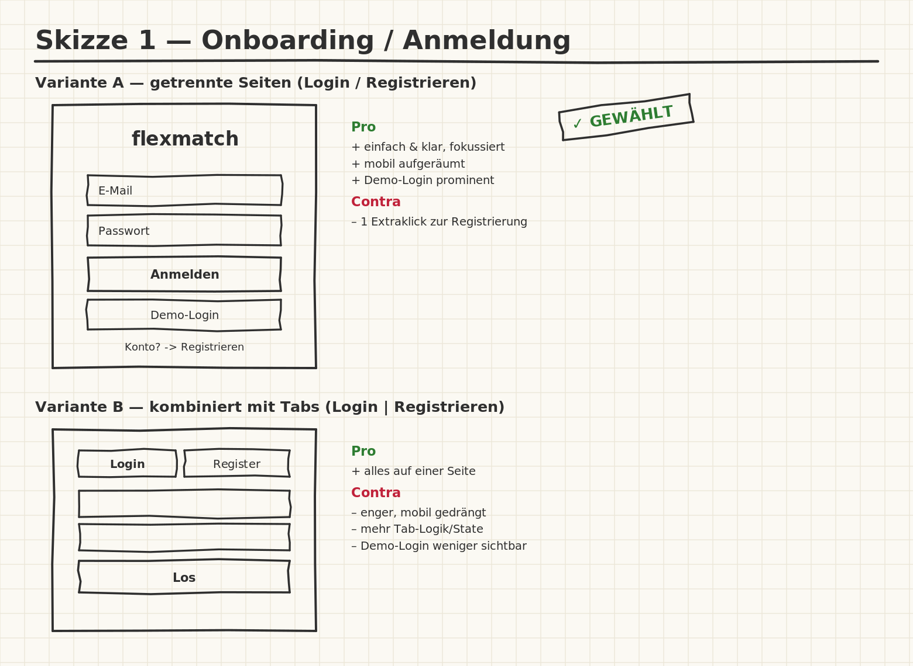
  *Onboarding: **Variante A – getrennte Login-/Registrierungsseiten** (gewählt) vs. Variante B – kombiniert mit Tabs. Pro A: einfach, fokussiert, Demo-Login prominent; Contra A: ein Extraklick zur Registrierung. → A umgesetzt (`/login`, `/register`).*

  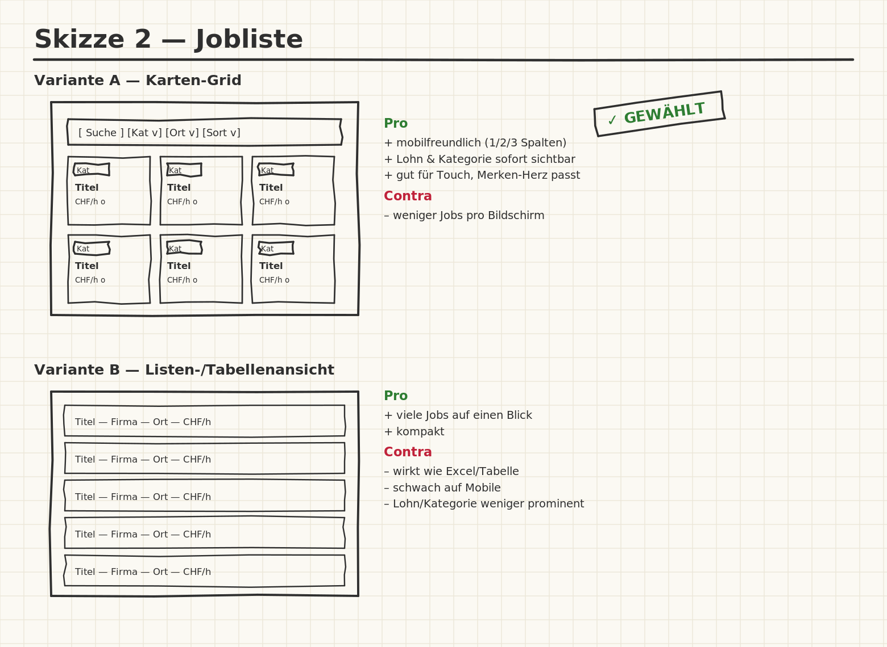
  *Jobliste: **Variante A – Karten-Grid** (gewählt) vs. Variante B – Listen-/Tabellenansicht. Pro A: mobilfreundlich, Lohn/Kategorie sofort sichtbar; Contra B: wirkt „Excel-artig", schwach auf Mobile. → A umgesetzt.*

  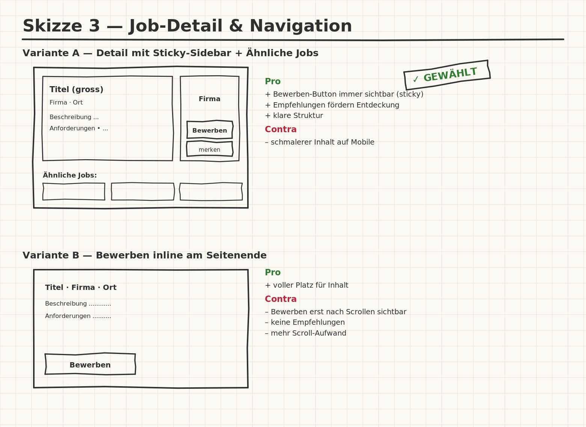
  *Job-Detail: **Variante A – Sticky-Sidebar + Ähnliche Jobs** (gewählt) vs. Variante B – Bewerben inline am Seitenende. Pro A: Bewerben-Button immer sichtbar, Empfehlungen fördern Entdeckung; Contra A: schmalerer Inhalt auf Mobile. → A umgesetzt.*

### 3.3 Decide

- **Gewählte Variante & Begründung:** **Karten-Grid (Bootstrap Card-Grid) mit Filter-/Suchleiste oben.** Entscheidkriterien:
  - **Mobile-First** – Cards skalieren sauber von 1 (xs) über 2 (md) auf 3 Spalten (lg).
  - **Mentales Modell** – Filter/Suche oben entspricht der Erwartung der Nutzenden (analog zu Booking.com, ricardo.ch).
  - **Informationsdichte** – Lohn und Kategorie sind pro Karte sofort erkennbar (zentrale Erkenntnis aus 3.1).

- **End-to-End-Ablauf (Happy Path):**
  1. Nutzer öffnet die Startseite → klickt «Jobs suchen»
  2. Sucht «Bar», wählt Kategorie «Gastronomie» und sortiert nach «Stundenlohn (hoch → tief)» → passende Jobs erscheinen sofort
  3. Klickt auf «Details & Bewerben» → liest Stellenbeschreibung und Anforderungen
  4. Klickt «Jetzt bewerben» → füllt das Formular aus → sendet ab
  5. Sieht die Erfolgsmeldung (inkl. Hinweis auf Speicherung) → navigiert zu «Meine Bewerbungen»

- **Mockup:** Vor der Implementierung wurde ein Referenz-Mockup der gewählten Lösung erstellt, an dem sich die Umsetzung orientiert. Es umfasst die sechs zentralen Screens des End-to-End-Ablaufs:

  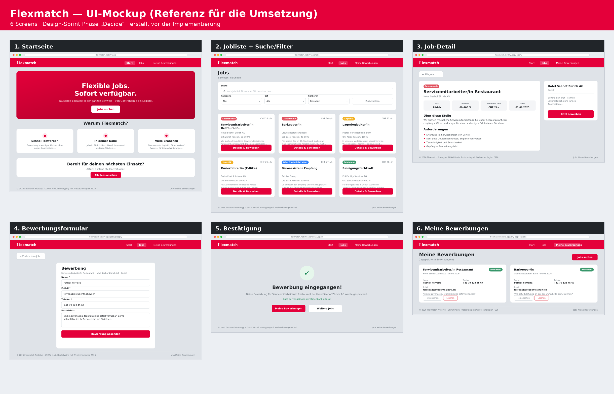
  *Referenz-Mockup (Phase „Decide"): Startseite, Jobliste mit Suche/Filter, Job-Detail, Bewerbungsformular, Bestätigung und „Meine Bewerbungen". Der implementierte Prototyp orientiert sich 1:1 an diesem Mockup.*

### 3.4 Prototype

#### 3.4.1 Entwurf (Design)

> **Hinweis:** Hier wird der **Prototyp** beschrieben, nicht das Mockup.

- **Informationsarchitektur:** Fünf Seiten in flacher Navigationsstruktur:

  ```
  /login                  → Anmeldung (Einstieg, inkl. Demo-Login)
  /register               → Registrierung
  /                       → Startseite (Hero, Vorteile, CTA) – nur eingeloggt
  /jobs                   → Jobliste mit Suche, Filter & Sortierung
  /jobs/[id]              → Job-Detail mit Sidebar & Empfehlungen
  /jobs/[id]/apply        → Bewerbungsformular
  /favorites              → Merkliste (gemerkte Jobs)
  /my-applications        → Bewerbungen + Mini-Dashboard
  /logout                 → Abmelden
  ```

  Navigationsfluss zwischen den Seiten:

  ```mermaid
  flowchart LR
    Login([Login / Registrierung]) --> Home[Startseite]
    Home --> Jobs[Jobliste]
    Jobs -->|Suche · Filter · Sortierung| Jobs
    Jobs --> Detail[Job-Detail]
    Detail -->|merken| Fav[Merkliste]
    Detail --> Apply[Bewerbung]
    Apply -->|Status: In Prüfung| MyApps[Meine Bewerbungen]
    Jobs --> Fav
    Jobs --> MyApps
  ```

- **User Interface Design** (Screenshots der fertigen App):

  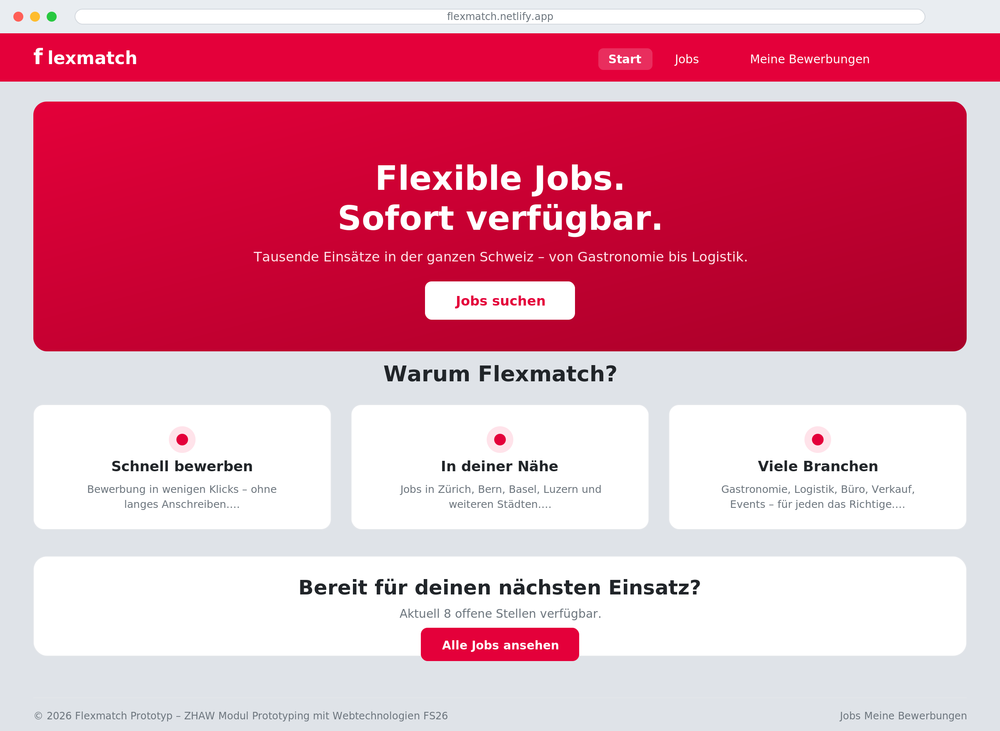
  *Startseite: Hero mit klarer Value Proposition („Flexible Jobs. Sofort verfügbar."), drei Vorteils-Karten und Call-to-Action. Primärfarbe `#e4003a` für Akzente und Buttons.*

  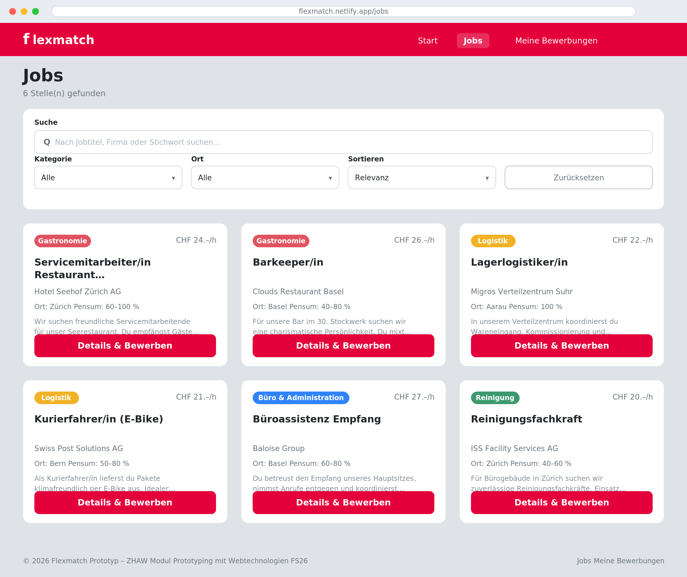
  *Jobliste: Volltext-Suche, Filter nach Kategorie/Ort und Sortierung in einer Leiste; darunter das responsive Karten-Grid. Jede Karte zeigt Kategorie-Badge (farbkodiert), Stundenlohn, Titel, Firma, Ort und Pensum. Die Trefferzahl aktualisiert sich live.*

  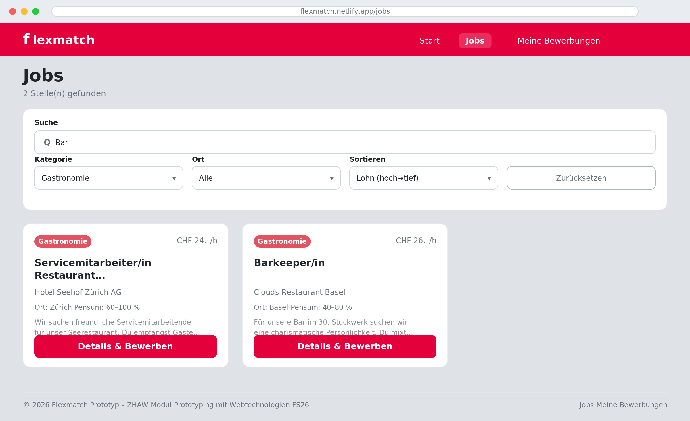
  *Gefilterte Ansicht (Kategorie „Gastronomie", Sortierung nach Lohn): Die Liste reagiert sofort ohne Server-Request (reaktive `$derived`-Logik). Trefferzahl passt sich an.*

  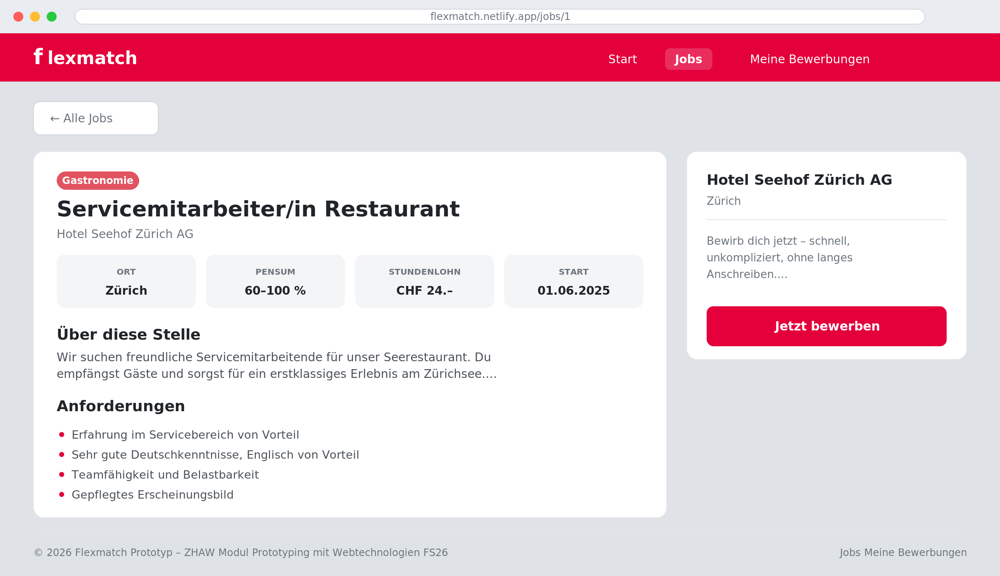
  *Job-Detail: Eckdaten (Ort, Pensum, Stundenlohn, Start) als Info-Kacheln, Beschreibung und Anforderungen. Rechts eine Sticky-Sidebar mit dem „Jetzt bewerben"-Button, der beim Scrollen sichtbar bleibt.*

  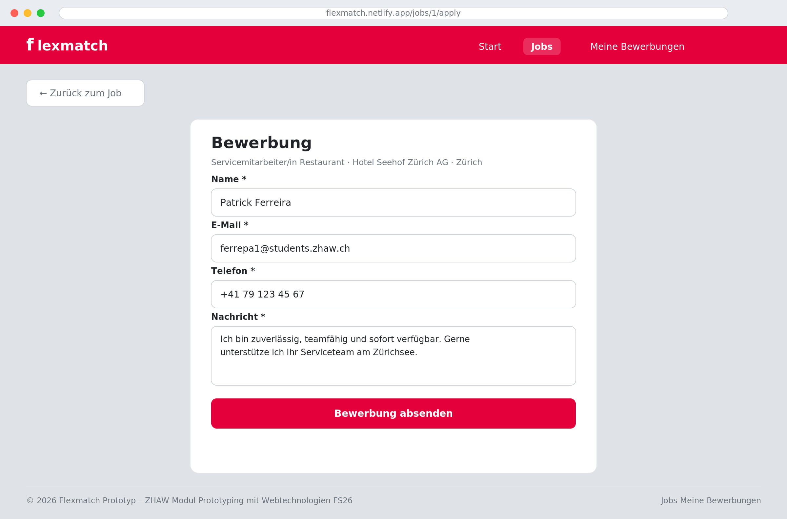
  *Bewerbungsformular: Name, E-Mail, Telefon und Nachricht. Server-seitige Validierung mit feldgenauen Fehlermeldungen (Bootstrap `is-invalid`).*

  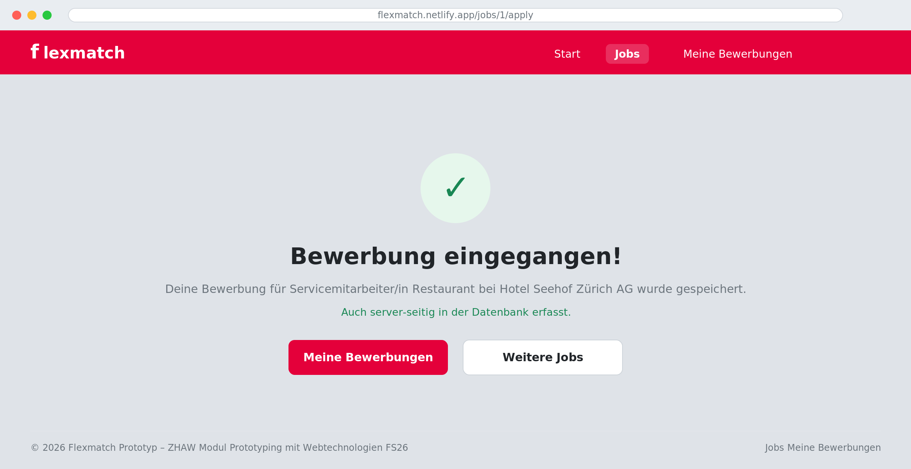
  *Bestätigung nach dem Absenden: klare Erfolgsmeldung inkl. Hinweis, dass die Bewerbung auch server-seitig in der Datenbank erfasst wurde – ohne Page-Reload (inline Zustandswechsel via `use:enhance`).*

  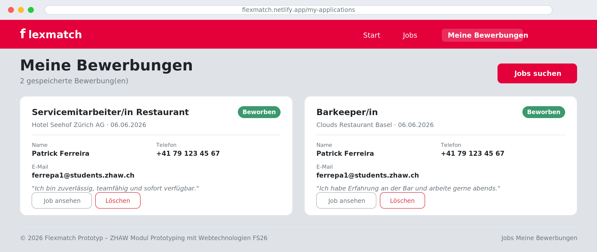
  *„Meine Bewerbungen": Übersicht aller gespeicherten Bewerbungen mit Firma, Datum, Kontaktdaten, Nachricht sowie „Job ansehen" und „Löschen".*

  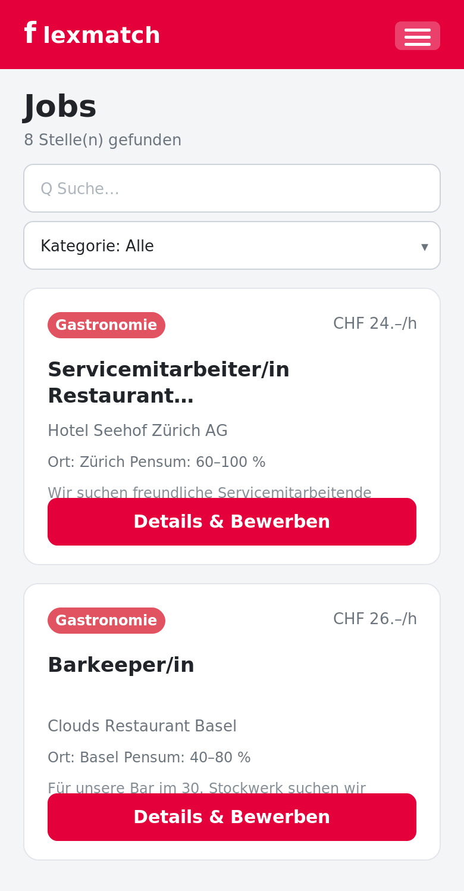
  *Mobile-First: Auf dem Smartphone bricht das Karten-Grid auf eine Spalte um; Suche und Filter bleiben voll bedienbar.*

- **Designentscheidungen:**
  - **Farbkodierte Kategorie-Badges** (Gastronomie = rot, Logistik = gelb, Büro = blau, …) für schnelle Orientierung (Nielsen #1 *Visibility of system status*).
  - **Hover-Effekt** auf Job-Cards (`translateY(-4px)`) signalisiert Interaktivität (Affordance).
  - **Sticky-Sidebar** auf der Detailseite hält die primäre Aktion stets erreichbar.
  - **Bewusst kein Dark Mode** – ein helles, professionelles Design passt zur seriösen Vermittlungs-Anmutung.
  - **Inline-Erfolgsmeldung statt Reload** – schnelleres Feedback, kein Kontextverlust (Nielsen #1).

#### 3.4.2 Umsetzung (Technik)

- **Technologie-Stack:**

  | Technologie | Version | Zweck |
  |---|---|---|
  | SvelteKit | 2.x | Web-Framework, Routing, Server-Load, Form Actions |
  | Svelte | 5.x (Runes) | UI-Komponenten (`$state`, `$props`, `$derived`) |
  | Bootstrap | 5.3 (CDN) | Responsives Layout, UI-Komponenten |
  | MongoDB Atlas | 7.x | Datenbank (Collections `jobs`, `bewerbungen`) |
  | Vite | 5.x | Build-Tool |
  | Node.js | 18 | Laufzeitumgebung |
  | @sveltejs/adapter-netlify | 6.x | Deployment-Adapter |

- **Tooling:** Visual Studio Code als IDE, Git/GitHub für Versionskontrolle, Netlify für Deployment. Der Einsatz von KI ist in Kap. **6. KI-Deklaration** beschrieben.

- **Struktur & Komponenten:**
  - `Navbar.svelte` – globale Navigation mit aktivem Link-Highlighting via `$app/stores`
  - `JobCard.svelte` – wiederverwendbare Job-Karte mit Props (`job`) und farbkodierten Badges (`$derived`)
  - `src/lib/jobs.js` – zentrale Jobdaten sowie die Filterlisten (Kategorien, Orte)
  - `src/lib/server/db.js` – MongoDB-Datenbankschicht (`getAllJobs`, `getJobById`, `createBewerbung`) **mit Fallback** auf statische Daten
  - `src/lib/stores/applications.js` – `localStorage`-Hilfsfunktionen für Bewerbungen
  - Datenseiten nutzen `+page.server.js` mit `load()`-Funktion (Cheat-Sheet-konform)
  - Das Bewerbungsformular nutzt **SvelteKit Form Actions** (`?/bewerben`) mit server-seitiger Validierung

- **Daten & Schnittstellen:**

  ```mermaid
  erDiagram
    JOBS {
      string id
      string title
      string company
      string location
      string category
      number hourlyRate
      string workload
      string description
      array  requirements
      date   date
    }
    BEWERBUNGEN {
      string jobId
      string jobTitel
      string firma
      string name
      string email
      string telefon
      string nachricht
      date   datum
    }
    JOBS ||--o{ BEWERBUNGEN : "Bewerbung auf"
  ```

  - Jobs werden server-seitig aus **MongoDB Atlas** geladen (`flexmatchDB.jobs`). Fehlt die Verbindung, greift automatisch ein Fallback auf die statischen Jobdaten aus `src/lib/jobs.js` (siehe Kap. 4.6). Das Feld `date` bezeichnet das Ausschreibungs-/Startdatum und dient der Sortierung „Neueste zuerst".
  - Bewerbungen werden **server-seitig** in `flexmatchDB.bewerbungen` gespeichert (Form Action → `createBewerbung`) **und** zusätzlich client-seitig im `localStorage` gespiegelt, damit „Meine Bewerbungen" auch ohne Konto sofort verfügbar ist.
  - Seed-Script: `node scripts/seed.js` befüllt die Datenbank mit Beispieldaten.
  - Umgebungsvariable `MONGODB_URI` in `.env` (lokal) bzw. als Netlify Environment Variable (Produktion).

- **Deployment:** https://flexmatch-zhaw.netlify.app
  - Adapter: `@sveltejs/adapter-netlify`
  - `netlify.toml`: `publish = "build"`, `external_node_modules = ["mongodb"]`

- **Besondere Entscheidungen:**
  - `process.env.MONGODB_URI` statt `$env/static/private` – Letzteres verursachte Bundling-Fehler in den Netlify Functions.
  - **Graceful Fallback** in `db.js`: Der Prototyp bleibt auch ohne erreichbare Datenbank vollständig bedienbar – wichtig für eine robuste Demo und für die Evaluation.

### 3.5 Validate

> Die nachfolgende Evaluation wurde im Rahmen des Pflichttermins der Kleinklasse durchgeführt. Sie folgt der im Unterricht vermittelten Methodik (Thinking-Aloud, Feedback-Grid, Severity-Einstufung).
>
> **Hinweis zur Chronologie:** Die Screenshots in Kap. 3.4 zeigen den **finalen** Stand nach Einarbeitung der hier abgeleiteten Verbesserungen (Kap. 4). Die Evaluation fand auf einer **früheren** Version **ohne** Volltext-Suche und Sortierung statt – daher die entsprechenden Befunde in den Issues 3.5.1/3.5.2.

- **URL der getesteten Version:** https://flexmatch-zhaw.netlify.app (getestet am **20.05.2026**)
- **Ziele der Prüfung:**
  - Finden neue Nutzende ohne Anleitung einen passenden Job und können sie sich bewerben?
  - Werden Suche, Filter und Sortierung intuitiv genutzt und verstanden?
  - Sind die Begriffe und Eckdaten (Pensum, Stundenlohn, Kategorien) verständlich?
  - Welche Workflows fehlen aus Nutzersicht für die Akzeptanz als Vermittlungs-Tool?
- **Vorgehen:** Moderierte **On-Site**-Usability-Evaluation am 20.05.2026 im Pflichttermin der Kleinklasse. Thinking-Aloud-Methode mit Feedback-Grid-Protokollierung pro Testperson, anschliessend gemeinsame Diskussion zur Konsolidierung. Testskript siehe Kap. 7 (Anhang).
- **Stichprobe:**

  | # | Name | E-Mail | Profil |
  |---|---|---|---|
  | 1 | Marko Vukcevic | vukcema1@students.zhaw.ch | Wirtschaftsinformatik-Student, smartphone-affin, zielgruppennah |
  | 2 | Valdrin Dalipi | dalipval@students.zhaw.ch | Wirtschaftsinformatik-Student, sucht selbst gelegentlich Nebenjobs |

  > **Zielgruppen-Passung:** Beide Testpersonen entsprechen mit Alter, Studierendenstatus und Smartphone-Nutzung der **primären Zielgruppe** (Studierende, die flexible Einsätze suchen). Die Ergebnisse sind damit gut auf die Zielgruppe übertragbar; ergänzend wäre eine spätere Iteration mit Arbeitgeber-Probanden sinnvoll.

  > **Reziprozität:** Im Rahmen desselben Pflichttermins habe ich umgekehrt die Projekte **buildex** (Marko Vukcevic) und **StudyStreak** (Valdrin Dalipi) getestet (siehe Cross-Reference im Anhang).

- **Aufgaben/Szenarien:**

  > *Ausgangslage:* Sie sind Studierende/r und suchen einen flexiblen Nebenjob in der Schweiz.

  > **Aufgabe 1:** Verschaffen Sie sich einen Überblick über die verfügbaren Jobs.
  > *Erfolgskriterium: Jobliste wird gefunden, Karten werden interpretiert.*
  >
  > **Aufgabe 2:** Finden Sie eine Stelle in der Gastronomie und sortieren Sie nach dem höchsten Stundenlohn.
  > *Erfolgskriterium: Filter/Suche und Sortierung werden gefunden und korrekt angewendet.*
  >
  > **Aufgabe 3:** Öffnen Sie die Details einer Stelle und prüfen Sie Pensum und Anforderungen.
  > *Erfolgskriterium: Detailseite wird verstanden, Eckdaten werden gefunden.*
  >
  > **Aufgabe 4:** Bewerben Sie sich auf die Stelle.
  > *Erfolgskriterium: Formular wird ausgefüllt und abgesendet, Bestätigung wird wahrgenommen.*
  >
  > **Aufgabe 5:** Prüfen Sie, ob Ihre Bewerbung gespeichert wurde.
  > *Erfolgskriterium: „Meine Bewerbungen" wird gefunden, Eintrag ist vorhanden.*

- **Kennzahlen & Beobachtungen (Task-Erfolg pro Testperson):**

  | Task | Marko | Valdrin | Beobachtung |
  |---|---|---|---|
  | T1 – Job-Überblick | ✅ abgeschlossen | ✅ abgeschlossen | Karten-Layout sofort verstanden, Lohn/Kategorie werden positiv erwähnt. |
  | T2 – Filtern & Sortieren | ⚠️ mit Umweg | ⚠️ mit Umweg | Filter werden genutzt; beide suchten **zuerst ein Such-Eingabefeld** und eine **Sortier-Option**, die in der getesteten Version noch **nicht vorhanden** waren. |
  | T3 – Detail prüfen | ✅ abgeschlossen | ✅ abgeschlossen | Eckdaten-Kacheln und Anforderungen klar; Sidebar wird gelobt. |
  | T4 – Bewerben | ✅ abgeschlossen | ✅ abgeschlossen | Formular läuft sauber durch; Validierungs-Feedback ist hilfreich. |
  | T5 – Bewerbung prüfen | ✅ abgeschlossen | ⚠️ mit Umweg | Eintrag wird gefunden; Valdrin war unsicher, **ob die Bewerbung wirklich „echt" gespeichert** wurde (nur lokal). |

  > ⚠️ = abgeschlossen mit merklichem Umweg/Verzögerung · ❌ = nicht abschliessbar.

  **Task-Completion:** 5/5 Aufgaben gelöst, 0 Abbrüche (T1/T3/T4 direkt erfolgreich; T2/T5 erfolgreich mit Umweg).

- **Feedback-Grid – Marko Vukcevic:**

  | ✅ Was hat gut funktioniert | ❌ Was hat gestört |
  |---|---|
  | Karten-Grid übersichtlich, Lohn sofort sichtbar | Keine Volltext-Suche – wollte „Bar" eintippen |
  | Bewerbung ohne Konto = niedrige Hürde | Keine Sortierung nach Lohn |
  | Mobile-Ansicht sauber | – |

  | 💡 Neue Ideen / Anforderungen | ❓ Was war unklar |
  |---|---|
  | Suchfeld + Sortierung nach Lohn/Datum | Wird die Bewerbung an die Firma gesendet? |

- **Feedback-Grid – Valdrin Dalipi:**

  | ✅ Was hat gut funktioniert | ❌ Was hat gestört |
  |---|---|
  | Detailseite mit Sticky-Bewerben-Button | Bewerbung wirkt „nur lokal", unverbindlich |
  | Farbige Kategorie-Badges zur Orientierung | Sortierung fehlte |
  | Klares Validierungs-Feedback im Formular | – |

  | 💡 Neue Ideen / Anforderungen | ❓ Was war unklar |
  |---|---|
  | Bewerbung server-seitig speichern + klar bestätigen | Bleibt die Bewerbung nach Browserwechsel erhalten? |

- **Issue Map (Severity 0–4 nach Nielsen):**

  | Issue-ID | Beschreibung | Schweregrad | Häufigkeit |
  |---|---|---|---|
  | **3.5.1** | Keine Volltext-Suche – Tester suchten aktiv ein Suchfeld | **3 – Gross** | beide (Konsens) |
  | **3.5.2** | Keine Sortierung (Lohn/Datum) | **3 – Gross** | beide (Konsens) |
  | 3.5.3 | Bewerbung nur lokal gespeichert – wirkt unverbindlich | 2 – Klein | beide |
  | 3.5.4 | Bestätigung kommuniziert die Speicherung nicht klar | 1 – Kosmetisch | Valdrin |

- **Zusammenfassung der Resultate:** Der grundlegende Flow (Suchen → Detail → Bewerben → Übersicht) funktioniert für beide Testpersonen reibungslos und wird als angenehm niederschwellig empfunden. Die deutlichsten Schwachstellen betrafen das **Auffinden** (fehlende Volltext-Suche und Sortierung) sowie die **Verbindlichkeit** der Bewerbung (nur lokale Speicherung). Alle vier Issues wurden anschliessend im Prototyp adressiert.

- **Abgeleitete Verbesserungen (Priorisierung):**

  | Priorität | Massnahme | Status | Begründung |
  |---|---|---|---|
  | **Hoch** | Volltext-Suche einbauen | ✅ umgesetzt in [Erweiterung 4.3](#43-volltext-suche) | Issue 3.5.1 – Konsens beider Tester |
  | **Hoch** | Sortierung (Lohn/Datum) ergänzen | ✅ umgesetzt in [Erweiterung 4.4](#44-sortierung) | Issue 3.5.2 – Konsens beider Tester |
  | **Mittel** | Bewerbung server-seitig in MongoDB speichern | ✅ umgesetzt in [Erweiterung 4.5](#45-server-seitige-bewerbungs-speicherung) | Issue 3.5.3 – Verbindlichkeit |
  | **Gering** | Speicherung in der Bestätigung klar kommunizieren | ✅ umgesetzt in [Erweiterung 4.5](#45-server-seitige-bewerbungs-speicherung) | Issue 3.5.4 – Klarheit |

---

## 4. Erweiterungen

> Die Erweiterungen gehen über den Mindestumfang hinaus. Sie gliedern sich in (a) Funktions-Erweiterungen, die teils **direkt aus der Evaluation** abgeleitet wurden, und (b) technische Vertiefungen (Datenbank, Resilienz).

**Zusätzliche Methoden & Artefakte über den Unterrichtsumfang hinaus** (jeweils kurz begründet):
- **ER-Datenmodellierung** als Mermaid-Diagramm (Kap. 3.4.2) – macht das Datenmodell explizit nachvollziehbar, über die reine Implementierung hinaus.
- **Proto-Personas** (Kap. 3.1) – schärfen die Zielgruppe und begründen die Designentscheide.
- **Heuristische Evaluation** mit Severity-Rating nach Nielsen (Kap. 3.5) – strukturierte, priorisierbare Befunde statt blosser Eindrücke.
- **Resilienz-Pattern** (Graceful Fallback, Kap. 4.6) – bewusste Software-Qualitäts-/Robustheitsmassnahme.

### 4.1 MongoDB Atlas Datenbankanbindung
- **Beschreibung & Nutzen:** Jobs werden server-seitig aus einer echten MongoDB-Atlas-Datenbank geladen statt aus einer statischen Datei. Realistische Simulation eines produktiven Systems und Demonstration des vollständigen Stacks (Cheat-Sheet-Kapitel „MongoDB + Svelte").
- **Wo umgesetzt:**
  - **Backend:** Singleton-Verbindung in `src/lib/server/db.js` mit `getAllJobs()` und `getJobById()`
  - **Datenbank:** MongoDB Atlas, Datenbank `flexmatchDB`, Collection `jobs`
  - **Deployment:** `MONGODB_URI` als Netlify Environment Variable
- **Referenz:** Kap. 3.4.2 (Daten & Schnittstellen)
- **Aus Evaluation abgeleitet?:** Nein – von Anfang an geplant.

### 4.2 Filter nach Kategorie und Ort
- **Beschreibung & Nutzen:** Jobs können gleichzeitig nach Kategorie und Ort gefiltert werden; die Trefferzahl wird live angezeigt.
- **Wo umgesetzt:**
  - **Frontend:** reaktive `$derived`-Filterlogik in `src/routes/jobs/+page.svelte`; zwei `<select>` mit `bind:value`
- **Referenz:** Screenshot Kap. 3.4.1
- **Aus Evaluation abgeleitet?:** Nein – Kernfunktion von Beginn an.

### 4.3 Volltext-Suche
- **Beschreibung & Nutzen:** Freitext-Suche über Jobtitel, Firma, Beschreibung und Kategorie. Nutzende finden Stellen über Stichworte (z. B. „Bar") statt nur über Dropdowns – schnelleres Auffinden (Nielsen #6 *Recognition over Recall*).
- **Wo umgesetzt:**
  - **Frontend:** Such-Input mit `bind:value={searchTerm}` und erweiterte `$derived`-Logik (case-insensitive `includes`) in `src/routes/jobs/+page.svelte`
- **Referenz:** Screenshot „Jobliste" Kap. 3.4.1
- **Aus Evaluation abgeleitet?:** **Ja – direkte Antwort auf Issue 3.5.1.**

### 4.4 Sortierung
- **Beschreibung & Nutzen:** Sortierung der Trefferliste nach Stundenlohn (auf-/absteigend) oder Aktualität. Adressiert das wichtigste Entscheidungskriterium der Zielgruppe (Lohn).
- **Wo umgesetzt:**
  - **Frontend:** Sortier-`<select>` (`sortBy`) und `.sort()` innerhalb der `$derived`-Pipeline in `src/routes/jobs/+page.svelte`
- **Referenz:** Screenshot „Jobliste gefiltert" Kap. 3.4.1
- **Aus Evaluation abgeleitet?:** **Ja – direkte Antwort auf Issue 3.5.2.**

### 4.5 Server-seitige Bewerbungs-Speicherung
- **Beschreibung & Nutzen:** Bewerbungen werden zusätzlich zur lokalen Spiegelung server-seitig in MongoDB persistiert; die Bestätigung kommuniziert dies explizit. Erhöht die wahrgenommene Verbindlichkeit (Nielsen #1 *Visibility of system status*).
- **Wo umgesetzt:**
  - **Frontend:** Erfolgs-Hinweis in `src/routes/jobs/[id]/apply/+page.svelte` (`persistedToDb`)
  - **Backend:** Form Action `bewerben` ruft `createBewerbung()` in `src/routes/jobs/[id]/apply/+page.server.js`
  - **Datenbank:** Collection `bewerbungen` in `flexmatchDB`
- **Referenz:** Screenshot „Bestätigung" Kap. 3.4.1
- **Aus Evaluation abgeleitet?:** **Ja – Antwort auf Issues 3.5.3 und 3.5.4.**

### 4.6 Resilienz / Graceful Fallback
- **Beschreibung & Nutzen:** Ist keine Datenbank erreichbar (kein `MONGODB_URI` oder Timeout), liefert `db.js` automatisch die statischen Jobdaten. Der Prototyp bleibt jederzeit vollständig bedienbar – robuste Demo und ausfallsichere Evaluation.
- **Wo umgesetzt:**
  - **Backend:** `try/catch`-Fallback in `getAllJobs()` und `getJobById()` auf `src/lib/jobs.js` in `src/lib/server/db.js`
- **Referenz:** Kap. 3.4.2 (Besondere Entscheidungen)
- **Aus Evaluation abgeleitet?:** Nein – technische Qualitätsmassnahme.

### 4.7 Favoriten / Merkliste
- **Beschreibung & Nutzen:** Nutzende können Jobs per Herz-Icon merken und auf einer eigenen Seite (`/favorites`) wiederfinden – erleichtert den Vergleich mehrerer Stellen vor der Bewerbung.
- **Wo umgesetzt:**
  - **Frontend:** Herz-Toggle in `JobCard.svelte` und auf der Detailseite; Merklisten-Seite `src/routes/favorites/+page.svelte`; Navigationslink in `Navbar.svelte`
  - **Daten:** `src/lib/stores/favorites.js` (localStorage)
- **Referenz:** Navigation „Merkliste"
- **Aus Evaluation abgeleitet?:** Nein – nutzerseitige Komfortfunktion.

### 4.8 Ähnliche Jobs (Empfehlungen)
- **Beschreibung & Nutzen:** Auf der Job-Detailseite werden bis zu drei weitere Stellen derselben Kategorie vorgeschlagen – fördert das Entdecken passender Jobs.
- **Wo umgesetzt:**
  - **Backend:** `load()` in `src/routes/jobs/[id]/+page.server.js` filtert `getAllJobs()` nach Kategorie (ohne aktuellen Job, max. 3)
  - **Frontend:** Sektion „Ähnliche Jobs" in `src/routes/jobs/[id]/+page.svelte`
- **Referenz:** Job-Detailseite
- **Aus Evaluation abgeleitet?:** Nein – Discovery-Verbesserung.

### 4.9 Bewerbungs-Status & Bewerber-Dashboard
- **Beschreibung & Nutzen:** Jede Bewerbung erhält den Status «In Prüfung»; „Meine Bewerbungen" zeigt zusätzlich ein kleines Dashboard (Anzahl Bewerbungen, in Prüfung, gemerkte Jobs) und kommuniziert transparent, dass der Arbeitgeber die Bewerbung sichtet.
- **Wo umgesetzt:**
  - **Frontend:** Status-Badge + Statistik in `src/routes/my-applications/+page.svelte`; Status-Hinweis auf der Erfolgsseite `src/routes/jobs/[id]/apply/+page.svelte`
  - **Daten:** Statusfeld in `src/lib/stores/applications.js`
- **Referenz:** „Meine Bewerbungen", Bewerbungs-Bestätigung
- **Aus Evaluation abgeleitet?:** Teilweise – adressiert die Transparenz/Verbindlichkeit aus den Issues 3.5.3 und 3.5.4.

### 4.10 Authentifizierung & geschützte Bereiche
- **Beschreibung & Nutzen:** Registrierung und Login gaten die App – Jobs, Detailseiten, Bewerbung, Merkliste und Profil sind erst **nach Anmeldung** sichtbar (Leitidee bestehender Schweizer Vermittlungsplattformen). Ein **Demo-Login** senkt die Hürde zum Ausprobieren und für die Video-Demonstration.
- **Wo umgesetzt:**
  - **Backend:** `createUser()`/`verifyUser()` in `src/lib/server/db.js` (Passwörter als SHA-256-Hash via `node:crypto`); Cookie-Session in `src/hooks.server.js` → `event.locals.user`; Form-Actions in `src/routes/login/+page.server.js` und `src/routes/register/+page.server.js`; Routen-Schutz via `redirect(303, '/login')` in den `+page.server.js` der geschützten Seiten
  - **Frontend:** `src/routes/login`, `src/routes/register`, bedingte Navigation in `src/lib/components/Navbar.svelte`
  - **Demo-Login:** `demo@flexmatch.ch` / `demo1234` (funktioniert auch ohne DB-Verbindung)
- **Referenz:** Screenshots „Login" / „Registrierung" Kap. 3.4.1; Information Architecture Kap. 3.4.2
- **Aus Evaluation abgeleitet?:** Nein – Ergebnis der Leitidee-Analyse (Konto vor Jobsuche, wie bei vergleichbaren Plattformen üblich).

### 4.11 Bewerber-Profil
- **Beschreibung & Nutzen:** Eigene Profilseite mit Lebenslauf-Upload, „Über mich", Erfahrung/Einsätzen, Ausbildung, Sprachen und Kundenbewertungen (Sterne). Das Profil wird Arbeitgebern bei einer Bewerbung angezeigt – das erhöht Vertrauen und Aussagekraft der Bewerbung (Leitidee-Analyse vergleichbarer Plattformen).
- **Wo umgesetzt:**
  - **Backend:** Routen-Schutz in `src/routes/profile/+page.server.js` (`redirect(303, '/login')` ohne Session)
  - **Frontend:** `src/routes/profile/+page.svelte` (CV-Upload via verstecktes File-Input, „Über mich"-Textarea, Erfahrung/Einsätze, Ausbildung ZHAW, Sprachen, Bewertungs-Balken); Persistenz in `src/lib/stores/profile.js` (localStorage `flexmatch_profil`)
  - **Verknüpfung:** Hinweis auf der Bewerbungs-Erfolgsseite (`src/routes/jobs/[id]/apply/+page.svelte`), dass das Profil dem Arbeitgeber angezeigt wird
- **Referenz:** Screenshot „Profil" Kap. 3.4.1; Figma-Prototyp (Profil-Screen)
- **Aus Evaluation abgeleitet?:** Nein – Ergebnis der Leitidee-Analyse (Arbeitgeber-Sicht auf Bewerbende).

---

## 5. Projektorganisation

### 5.1 Vorgehensmodell
Das Projekt folgte dem im Unterricht vermittelten **Design-Sprint-Vorgehen** (Understand → Sketch → Decide → Prototype → Validate, vgl. Kap. 3). Die Phasen wurden iterativ durchlaufen: Nach der Validierung (Usability-Test 20.05.2026) flossen die Befunde direkt als Erweiterungen (Kap. 4) zurück in den Prototyp.

### 5.2 Werkzeuge & Technologie-Stack
| Bereich | Werkzeug |
|---|---|
| Code-Editor | Visual Studio Code |
| Framework | SvelteKit 2 / Svelte 5 (Runes) |
| UI | Bootstrap 5.3 |
| Datenbank | MongoDB Atlas (`flexmatchDB`) |
| Versionskontrolle | Git / GitHub (`ferrepa/Flexmatch`, public) |
| Deployment | Netlify (`adapter-netlify`, Continuous Deployment ab `git push`) |
| Design / Prototyp | Figma (interaktiver Klick-Prototyp) |
| Diagramme | Mermaid (Information Architecture, ER-Modell, Flow) |

### 5.3 Versionskontrolle & Issue-Management
Der Quellcode wird mit **Git** versioniert und auf **GitHub** gehostet; Netlify deployt automatisch bei jedem `git push`. Aus den Befunden des Usability-Tests (Kap. 3.5) wurden **vier GitHub-Issues** angelegt und nach Umsetzung der jeweiligen Erweiterung wieder geschlossen – so ist der Weg vom Befund zur Lösung lückenlos nachvollziehbar:

| Issue | Befund (Eval) | Umgesetzt in | Status |
|---|---|---|---|
| #1 Jobliste: Volltext-Suche fehlt | 3.5.1 | Erweiterung 4.3 | ✅ closed |
| #2 Jobliste: Sortierung nach Lohn/Datum fehlt | 3.5.2 | Erweiterung 4.4 | ✅ closed |
| #3 Bewerbung wirkt unverbindlich (nur lokal gespeichert) | 3.5.3 | Erweiterung 4.5 | ✅ closed |
| #4 Bestätigung kommuniziert Speicherung nicht klar | 3.5.4 | Erweiterung 4.5 / 4.9 | ✅ closed |

Issue-Tracker: https://github.com/ferrepa/Flexmatch/issues

**Commit-Praxis:** Sprechende Commit-Messages nach Konvention (`feat:`, `docs:`) mit Referenz auf die zugehörigen Issues (z. B. `#1 #2 #3 #4`), sodass jede Änderung dem auslösenden Befund zugeordnet werden kann.

### 5.4 Meilensteine
| Zeitraum | Meilenstein |
|---|---|
| Apr. 2026 | Understand & Define, Proto-Personas, Hand-Skizzen (Kap. 3.1–3.2) |
| Anf. Mai 2026 | Decide & Prototyp-Aufbau (SvelteKit, Bootstrap, Routen, MongoDB) |
| 20.05.2026 | Usability-Test (reziprok mit Marko Vukcevic & Valdrin Dalipi) |
| 21.–31.05.2026 | Erweiterungen aus Evaluation: Volltext-Suche, Sortierung, server-seitige Persistenz |
| 01.–06.06.2026 | Authentifizierung, Profil, Dokumentation, Deployment, Abgabe |

### 5.5 Qualitätssicherung
- `npm run build` als Build-Gate vor jedem Deploy (fehlerhafter Build = kein Push/Deploy)
- Manuelle Durchklick-Tests der Kernflows nach jeder Erweiterung
- **Graceful Fallback** (Kap. 4.6) sichert den Betrieb auch ohne DB-Verbindung
- Konsistente Code-Struktur nach SvelteKit-Konventionen (Routen, `+page.server.js`, Stores, Komponenten)

---

## 6. KI-Deklaration

Die folgende Deklaration ist verpflichtend und legt den Einsatz von KI im Projekt offen.

### 6.1 KI-Tools
- **Eingesetzte Tools:** Claude (Anthropic) als KI-Assistent. Im Editor wurde keine automatische KI-Codevervollständigung verwendet.
- **Zweck & Umfang:** KI wurde **unterstützend** eingesetzt für (a) Codevorschläge und Refactoring von SvelteKit-Komponenten, Server-Logik (Form-Actions, Authentifizierung, MongoDB-Anbindung) sowie Debugging, (b) das Strukturieren und Ausformulieren dieser Dokumentation entlang der Vorlage und (c) Unterstützung bei den Mermaid-Diagrammen und dem Figma-Prototyp. Teile des Codes und der Texte entstanden damit teilweise mit KI-Unterstützung.
- **Eigene Leistung (Abgrenzung):** Problemstellung, Lösungsidee, Informationsarchitektur und Designentscheide, Auswahl und Konfiguration des Technologie-Stacks, Durchführung und Auswertung des Usability-Tests, das manuelle Testen sowie alle fachlichen Entscheidungen wurden **eigenständig** erbracht. Sämtliche KI-Vorschläge wurden geprüft, angepasst, integriert und inhaltlich nachvollzogen; die Verantwortung für das Endergebnis liegt beim Autor.

### 6.2 Prompt-Vorgehen
Es wurde **iterativ und kontextbezogen** geprompt: Anforderungen, bestehender Code und das Prototyping-Cheat-Sheet wurden als Kontext bereitgestellt, die Ergebnisse anschliessend gelesen, getestet und bei Bedarf nachgebessert (Beispiel-Prompt: *„Erstelle eine geschützte SvelteKit-Route `/profile` mit Redirect auf `/login`, wenn keine Session vorhanden ist"*). Generierte Inhalte wurden auf Korrektheit und Eigenständigkeit geprüft; es wurden keine urheberrechtlich geschützten Inhalte übernommen und keine vertraulichen oder personenbezogenen Daten Dritter an die KI übergeben.

### 6.3 Reflexion
- **Nutzen:** Spürbare Zeitersparnis bei Boilerplate-Code, schnelleres Debugging und eine strukturierte, vollständige Dokumentation.
- **Grenzen:** KI-Ausgaben sind nicht immer korrekt oder vollständig und müssen verifiziert werden – so wurde z. B. eine unvollständig gespeicherte Dokumentationsdatei beim Review erkannt und korrigiert.
- **Risiken & Qualitätssicherung:** `npm run build` als Build-Gate, manuelle Durchklick-Tests der Kernflows, Code-Review jeder Änderung sowie das Nachvollziehen der Funktionsweise vor der Übernahme.

---

## 7. Anhang

### 7.1 Zugang & Links
- **Live-Demo:** https://flexmatch-zhaw.netlify.app
- **Demo-Login:** `demo@flexmatch.ch` / `demo1234`
- **Repository:** https://github.com/ferrepa/Flexmatch
- **Figma-Prototyp:** https://www.figma.com/design/ZlzqO8R94gHmY8DCFV4zNj

### 7.2 Usability-Test – Testskript (Auszug)
Aufgaben der Testpersonen (Thinking-Aloud):
1. Registriere dich bzw. melde dich an.
2. Finde einen Job in der Gastronomie in Zürich.
3. Suche gezielt nach einem Stichwort (z. B. „Bar").
4. Öffne einen Job und sende eine Bewerbung ab.
5. Finde den Status deiner Bewerbung wieder.

### 7.3 Cross-Reference (Reziprozität)
Im selben Pflichttermin (20.05.2026) wurden die Projekte gegenseitig getestet:
- **buildex** – Marko Vukcevic (vukcema1@students.zhaw.ch)
- **StudyStreak** – Valdrin Dalipi (dalipval@students.zhaw.ch)

### 7.4 Quellen & Hilfsmittel
- Prototyping Cheat Sheet (Kursunterlagen)
- Offizielle Dokumentation zu SvelteKit, Svelte, Bootstrap und MongoDB
- Leitidee-Analyse bestehender Schweizer Vermittlungsplattformen (allgemeine Konzepte; kein Code und keine Inhalte übernommen)